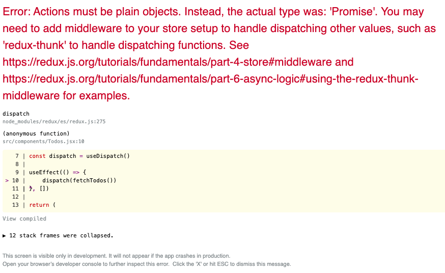

# Thunk Example

## the problem it comes to solve

In redux, an action creator is the function that we can put in the dispatch, that returns an action.
If we wish to perform an async function in the action creator, we will encounter a problem since:
1. Action creators can only return plain javascript objects with a type property
2. 

So, if we will try to fetch data from an API like in the following code:

```
export const FETCH_TODOS = 'FETCH_TODOS'
 
export const fetchTodos = async () => {
    const response = await fetch('https://jsonplaceholder.typicode.com/todos')

    return {
        type: FETCH_TODOS,
        payload: response.data
    }
}
```
we will get the following error:


The reason is that allthough it looks like we are returning a simple object, the code we are writing is being converted to a plain javascript that all browsers can anderstand, by a tool call bubble. the translation to the oldest Javascript version looks somthing like this (I used https://babeljs.io/repl to translate the code above):
```
"use strict";

Object.defineProperty(exports, "__esModule", {
  value: true
});
exports.fetchTodos = void 0;

function asyncGeneratorStep(gen, resolve, reject, _next, _throw, key, arg) { try { var info = gen[key](arg); var value = info.value; } catch (error) { reject(error); return; } if (info.done) { resolve(value); } else { Promise.resolve(value).then(_next, _throw); } }

function _asyncToGenerator(fn) { return function () { var self = this, args = arguments; return new Promise(function (resolve, reject) { var gen = fn.apply(self, args); function _next(value) { asyncGeneratorStep(gen, resolve, reject, _next, _throw, "next", value); } function _throw(err) { asyncGeneratorStep(gen, resolve, reject, _next, _throw, "throw", err); } _next(undefined); }); }; }

var FETCH_TODOS = 'FETCH_TODOS';

var fetchTodos = /*#__PURE__*/function () {
  var _ref = _asyncToGenerator( /*#__PURE__*/regeneratorRuntime.mark(function _callee() {
    var response;
    return regeneratorRuntime.wrap(function _callee$(_context) {
      while (1) {
        switch (_context.prev = _context.next) {
          case 0:
            _context.next = 2;
            return fetch('https://jsonplaceholder.typicode.com/todos');

          case 2:
            response = _context.sent;
            return _context.abrupt("return", {
              type: FETCH_TODOS,
              payload: response.data
            });

          case 4:
          case "end":
            return _context.stop();
        }
      }
    }, _callee);
  }));

  return function fetchTodos() {
    return _ref.apply(this, arguments);
  };
}();

exports.fetchTodos = fetchTodos;
```

We can see that there is a switch case and the function returns an object only in case 2.


And if we will remove the async await and return the promise as the payload of the action:

```
export const fetchTodos = () => {
    const promise = fetch('https://jsonplaceholder.typicode.com/todos')

    return {
        type: FETCH_TODOS,
        payload: promise
    }
}
```

We won't get any error, but since the action will be sent to the reducer well before the promise will be resolved, we will not get the data in time for the reducer to apdate the store with it.


## The solution --> redux-thunk

Redux-thunk has **a redux-middleware** called **thunk** that what it does is allowing the action creators to return an object (with type property) OR return a function (instead of only an object)

### installation

```> npm install redux-thunk```

### usage

we need to add it to the applyMiddleware function in the creation of the store:

```
import thunk from 'redux-thunk';

const store = createStore(todosReducer, applyMiddleware(thunk))
```

and now the action creator can return an async function that will eventually dispatch the action:

```
export const fetchTodos = () => {

    return async (dispatch, getState) => {
        const response = await fetch('https://jsonplaceholder.typicode.com/todos')
        const data = await response.json()

        dispatch({
            type: FETCH_TODOS,
            payload: data
        })
    }
}
```

In shortened code:
```
export const fetchTodos = () => async (dispatch, getState) => {
    const response = await fetch('https://jsonplaceholder.typicode.com/todos')
    const data = await response.json()

    dispatch({
        type: FETCH_TODOS,
        payload: data
    })
}
```