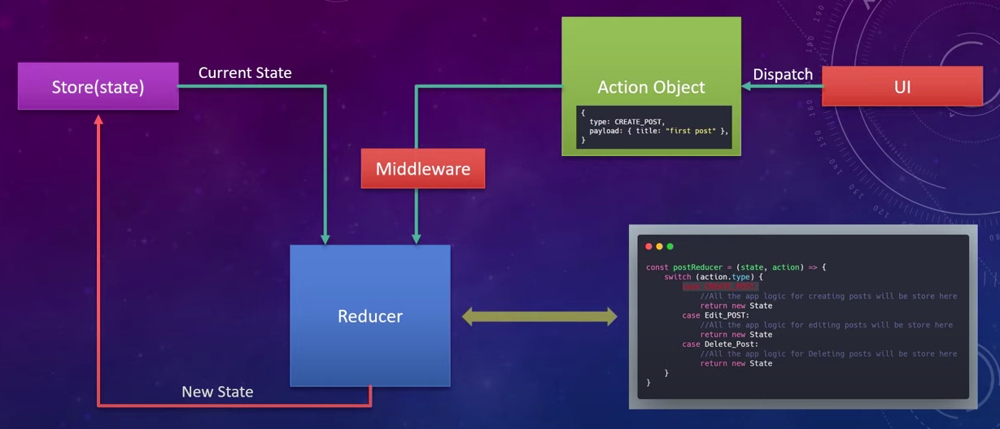
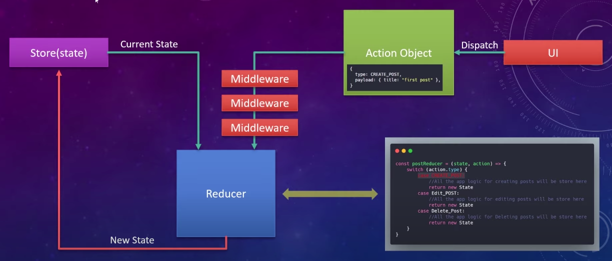

# React Redux Middleware

The examples in this section are based on this [youTube video](https://www.youtube.com/watch?v=qA6oyQQTJ3I&ab_channel=NetflixEngineering) by Sanjeev Thiyagarajan (I recommend watching it)
(The images are taken from the video)
 
 

## What are redux middelware used for?
The purpose of redux middleware is to intersap an action before it reaches the reducer.

In the middleware we can:
- perform extra logic
- modify the action itself:
    - change the action type
    - change, add or remove the payload)
- drop the action object so that it would never reaches the reducer

The only thing we can't do in middleware is change the state itself (since that is the responsibility of the reducer).

There can be more then one middlewares:

 

## Example 1: redux-middleware-example
A simple example of middleware usage